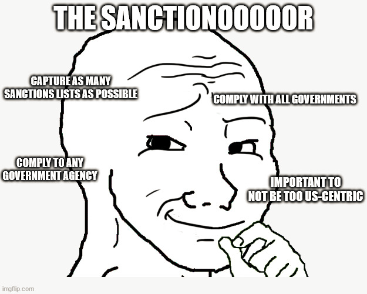

# sanctionooor

## reason to be

On August 9, 2022, the U.S. Department of the Treasury’s Office of Foreign Assets Control (OFAC) decided to [sanction Ethereum-based cryptocurrency mixing service Tornado Cash](https://home.treasury.gov/policy-issues/financial-sanctions/recent-actions/20220808).

This app will tell you what Ethereum RPC gateway providers decided to over-comply with OFAC sanctions and block your transactions, and which ones won't.

## downloads

You can build this app for yourself, or you can download pre-compiled binaries for Windows or macOS.

## others

A big thanks for [snitchy](https://snitchy.xyz/) for existing. Snitchy is a simple online tool to identify whether a given RPC endpoint has implemented the OFAC sanctions. Together we can make censored Ethereum RPC endpoints discoverable.

## warning

This app will run a request for a U.S. Treasury-sanctioned smart contract on the Ethereum blockchain through [each and every known gateway provider](https://github.com/svanas/ethereum-node-list). We need to assume all of them will log your IP address. Some of them will censor your transaction. Some of those censoring your transaction might block your API key from further usage. Worst case scenario and depending on your jurisdiction, you might incur in penalty or fines by the U.S. Department of Treasury.

## disclaimer

This app is provided free of charge. There is no warranty and no independent audit has been or will be commissioned. The authors do not assume any responsibility for bugs, vulnerabilities, or any other technical defects. Use at your own risk.
